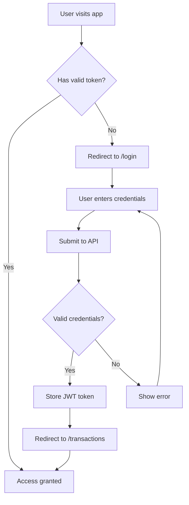

MyFinance UI implements JWT (JSON Web Token) based authentication to secure user access to financial data. All main application routes are protected and require valid authentication.

## Login Process

The login process is handled by the `/login` route, which is the only publicly accessible page in the application.

<Steps>
  <Step title="Navigate to Login">
    When users visit the application without authentication, they're automatically redirected to `/login`.

    ```typescript
    export const routes: Routes = [
      { path: 'login', 
        loadComponent: () => import('./components/login-form/login-form').then(m => m.LoginForm) 
      },
      // Protected routes...
    ];
    ```
  </Step>

  <Step title="Enter Credentials">
    Users provide their username and password through a validated form:

    ```typescript
    loginForm = this.fb.group({
      username: ['', Validators.required],
      password: ['', Validators.required]
    });
    ```

    Both fields are required and must be filled before submission is allowed.
  </Step>

  <Step title="Submit Login Request">
    When the form is submitted, credentials are sent to the authentication API:

    ```typescript
    async onSubmit() {
      const credentials = this.loginForm.value;

      const authResponse = await this.authService.login(
        credentials.username, 
        credentials.password
      );
      
      if (authResponse) {
        this.router.navigate(['/transactions']);
      }
    }
    ```
  </Step>

  <Step title="Token Storage">
    Upon successful authentication, the server returns a JWT token that is stored in localStorage:

    ```typescript
    async login(username: string, password: string): Promise<boolean> {
      const tokenResponse = await fetch(`${this.apiUrl}/login`, {
        method: 'POST',
        headers: { 'Content-Type': 'application/json' },
        body: JSON.stringify({ username, password })
      });

      if (!tokenResponse.ok) {
        console.error('Login failed:', tokenResponse.statusText);
        return false;
      }

      const tokenData: AuthModel = await tokenResponse.json();
      localStorage.setItem('access-token', tokenData.token);
      return true;
    }
    ```
  </Step>

  <Step title="Redirect to Dashboard">
    After successful login, users are redirected to the `/transactions` page, where they can start managing their finances.
  </Step>
</Steps>

## JWT Token Handling

The authentication service manages JWT tokens throughout the user's session.

### Token Storage

Tokens are stored in the browser's localStorage under the key `access-token`:

```typescript
localStorage.setItem('access-token', tokenData.token);
```

<Warning>
  While localStorage is convenient, be aware that it's accessible to JavaScript running on your domain. For production applications, consider additional security measures like httpOnly cookies.
</Warning>

### Token Retrieval

The service provides a method to retrieve the current token:

```typescript
getToken(): string | null {
  return localStorage.getItem('access-token');
}
```

This token is typically included in HTTP request headers for authenticated API calls.

### Token Validation

Before allowing access to protected routes, the application checks if the token exists and is not expired:

```typescript
isLoggedIn(): boolean {
  const token = localStorage.getItem('access-token') !== null;
  if (!token) {
    return false;
  }
  
  const payload = JSON.parse(atob(localStorage.getItem('access-token')!.split('.')[1]));
  return payload.exp > Date.now() / 1000;
}
```

This method:
1. Checks if a token exists in localStorage
2. Decodes the JWT payload (the middle section of the token)
3. Compares the expiration timestamp (`exp`) with the current time
4. Returns `true` if the token is valid and not expired

<Note>
  JWT tokens contain three parts separated by dots: header.payload.signature. The payload is base64-encoded and contains claims like expiration time.
</Note>

## Protected Routes

All main application routes are protected by the `authGuard`, which prevents unauthorized access.

### Route Configuration

The application uses Angular's `canActivate` guard to protect routes:

```typescript
export const routes: Routes = [
  { 
    path: 'login', 
    loadComponent: () => import('./components/login-form/login-form').then(m => m.LoginForm) 
  },
  {
    path: '',
    loadComponent: () => import('./components/layout/layout').then(m => m.Layout),
    canActivate: [authGuard],
    children: [
      { path: 'transactions', loadComponent: () => import('./components/transaction-form/transaction-form').then(m => m.TransactionForm) },
      { path: 'categories', loadComponent: () => import('./components/category-form/category-form').then(m => m.CategoryForm) },
      { path: 'reports', loadComponent: () => import('./components/transaction-reports/transaction-reports').then(m => m.TransactionReports) },
      { path: 'chart', loadComponent: () => import('./components/report-chart/report-chart').then(m => m.ReportChart) }
    ]
  },
  { path: '**', redirectTo: 'transactions' }
];
```

Notice that:
- The `/login` route is **not protected** (no `canActivate`)
- The parent route with `Layout` component **is protected**
- All child routes inherit the protection from their parent
- Any unknown route (`**`) redirects to `/transactions`

### Auth Guard Implementation

The `authGuard` is a functional guard that checks authentication status:

```typescript
export const authGuard: CanActivateFn = (route, state) => {
  const authService = inject(AuthService);
  const router = inject(Router);

  if (authService.isLoggedIn()) {
    return true;
  }

  router.navigate(['/login']);
  return false;
};
```

This guard:
1. Injects the `AuthService` and `Router`
2. Checks if the user is logged in using `isLoggedIn()`
3. Returns `true` if authenticated (allows navigation)
4. Redirects to `/login` if not authenticated and returns `false`

<Tabs>
  <Tab title="Authenticated User">
    When a user is authenticated:
    - Can access all protected routes (`/transactions`, `/categories`, `/reports`, `/chart`)
    - Token is automatically included in API requests
    - Session persists across page refreshes (until token expires)
    - Unknown routes redirect to `/transactions`
  </Tab>
  <Tab title="Unauthenticated User">
    When a user is not authenticated:
    - Can only access `/login` route
    - Attempting to access protected routes triggers redirect to `/login`
    - Must provide valid credentials to gain access
    - API requests fail without authentication token
  </Tab>
</Tabs>

## Logout Functionality

Users can log out by calling the logout method, which removes the authentication token:

```typescript
logout(): void {
  localStorage.removeItem('access-token');
}
```

After logout:
1. The token is removed from localStorage
2. Subsequent API requests will fail authentication
3. Navigation to protected routes will redirect to login
4. User must log in again to access the application

<Note>
  Remember to call the logout method before navigating away or when implementing a logout button in your navigation bar.
</Note>

## Login Form Structure

The login form provides a clean, user-friendly interface:

```html
<form [formGroup]="loginForm" (ngSubmit)="onSubmit()">
  <div>
    <label>Username</label>
    <input
      type="text"
      formControlName="username"
      placeholder="Enter your username"
    />
    @if (username.invalid && username.touched) {
      <p class="text-rose-600">Username is required.</p>
    }
  </div>

  <div>
    <label>Password</label>
    <input
      type="password"
      formControlName="password"
      placeholder="••••••••"
    />
    @if (password.invalid && password.touched) {
      <p class="text-rose-600">Password is required.</p>
    }
  </div>
  
  <button type="submit" [disabled]="loginForm.invalid">
    Sign In
  </button>
</form>
```

### Form Validation

| Field | Validation | Error Message |
|-------|------------|---------------|
| Username | Required | "Username is required." |
| Password | Required | "Password is required." |

The submit button is disabled until both fields are valid, preventing incomplete form submissions.

## Authentication Flow Diagram



## Security Best Practices

<AccordionGroup>
  <Accordion title="Token Expiration">
    JWT tokens include an expiration timestamp (`exp` claim). The application checks this before allowing access:
    
    ```typescript
    const payload = JSON.parse(atob(token.split('.')[1]));
    return payload.exp > Date.now() / 1000;
    ```
    
    Expired tokens are treated as invalid, requiring the user to log in again.
  </Accordion>

  <Accordion title="HTTPS in Production">
    Always use HTTPS in production to prevent token interception during transmission. Configure your API URL to use `https://` in production environments.
  </Accordion>

  <Accordion title="Token Refresh">
    Consider implementing token refresh logic to extend sessions without requiring users to log in again. This typically involves a refresh token endpoint and automatic token renewal before expiration.
  </Accordion>

  <Accordion title="Password Security">
    The login form uses `type="password"` to mask password input. Never log or display passwords in plain text, and ensure your backend properly hashes passwords.
  </Accordion>
</AccordionGroup>

## API Integration

The authentication flow integrates with your backend API:

```typescript
private apiUrl = `${env.myFinanceApiUrl}/Auth`;

async login(username: string, password: string): Promise<boolean> {
  const tokenResponse = await fetch(`${this.apiUrl}/login`, {
    method: 'POST',
    headers: { 'Content-Type': 'application/json' },
    body: JSON.stringify({ username, password })
  });
  
  if (!tokenResponse.ok) {
    console.error('Login failed:', tokenResponse.statusText);
    return false;
  }
  
  const tokenData: AuthModel = await tokenResponse.json();
  localStorage.setItem('access-token', tokenData.token);
  return true;
}
```

### Auth Model

The API response is expected to match this structure:

```typescript
export interface AuthModel {
  token: string;
}
```

<Card title="Source Code Reference" icon="code">
  View the complete implementation:
  - Auth Service: `src/app/services/Auth-service.ts`
  - Auth Guard: `src/app/guards/auth-guard.ts`
  - Login Form: `src/app/components/login-form/login-form.ts`
  - App Routes: `src/app/app.routes.ts`
</Card>

## Next Steps

<CardGroup cols={2}>
  <Card title="Transactions" icon="dollar-sign" href="/features/transactions">
    Start managing transactions after logging in
  </Card>
  <Card title="Categories" icon="folder" href="/features/categories">
    Set up categories to organize your finances
  </Card>
</CardGroup>
