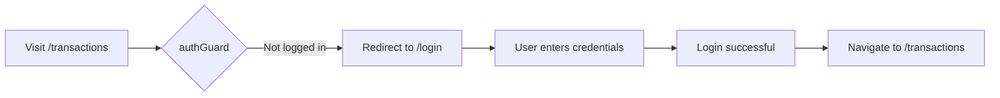
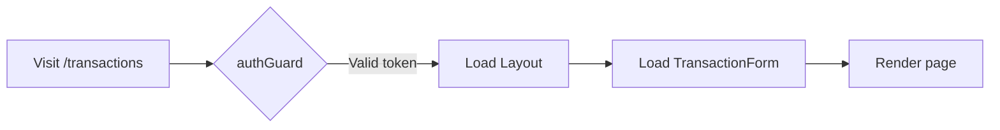

## Overview

MyFinance UI uses Angular's powerful routing system to provide a single-page application experience with lazy-loaded components and route-level authentication. The routing configuration is defined in `app.routes.ts` and uses modern functional guards and standalone components.

## Route Configuration

The complete routing configuration from `app.routes.ts:4-18`:

```typescript
export const routes: Routes = [
  { 
    path: 'login', 
    loadComponent: () => import('./components/login-form/login-form')
      .then(m => m.LoginForm) 
  },
  { 
    path: '',
    loadComponent: () => import('./components/layout/layout')
      .then(m => m.Layout),
    canActivate: [authGuard],
    children: [
      { 
        path: 'transactions', 
        loadComponent: () => import('./components/transaction-form/transaction-form')
          .then(m => m.TransactionForm) 
      },
      { 
        path: 'categories', 
        loadComponent: () => import('./components/category-form/category-form')
          .then(m => m.CategoryForm) 
      },
      { 
        path: 'reports', 
        loadComponent: () => import('./components/transaction-reports/transaction-reports')
          .then(m => m.TransactionReports) 
      },
      { 
        path: 'chart', 
        loadComponent: () => import('./components/report-chart/report-chart')
          .then(m => m.ReportChart) 
      }
    ]
  },
  { path: '**', redirectTo: 'transactions' },
];
```

## Route Structure

### Public Routes

<AccordionGroup>
  <Accordion title="/login - Login Page">
    **Component:** `LoginForm`
    
    **Access:** Public (no authentication required)
    
    **Purpose:** User authentication entry point
    
    The login route is the only public route in the application. It allows unauthenticated users to access the login form and obtain a JWT token.
    
    ```typescript
    { 
      path: 'login', 
      loadComponent: () => import('./components/login-form/login-form')
        .then(m => m.LoginForm) 
    }
    ```
  </Accordion>
</AccordionGroup>

### Protected Routes

All application features are nested under a protected parent route that uses the `Layout` component and enforces authentication via the `authGuard`.

<AccordionGroup>
  <Accordion title="/ (Root) - Application Shell">
    **Component:** `Layout`
    
    **Guard:** `authGuard`
    
    **Purpose:** Main application wrapper with navigation and authentication protection
    
    The root route loads the Layout component, which provides:
    - Application navbar
    - Toast notifications
    - RouterOutlet for child routes
    
    All child routes inherit authentication protection from this parent route.
  </Accordion>
  
  <Accordion title="/transactions - Transaction Management">
    **Component:** `TransactionForm`
    
    **Access:** Protected (requires authentication)
    
    **Purpose:** Create and manage financial transactions
    
    Features:
    - Reactive form with validation
    - Category selection based on transaction type
    - Date picker integration
    - Amount and description fields
  </Accordion>
  
  <Accordion title="/categories - Category Management">
    **Component:** `CategoryForm`
    
    **Access:** Protected (requires authentication)
    
    **Purpose:** Manage income and expense categories
    
    Features:
    - Create, update, delete categories
    - Separate Income and Expense categories
    - Category listing and management
  </Accordion>
  
  <Accordion title="/reports - Transaction Reports">
    **Component:** `TransactionReports`
    
    **Access:** Protected (requires authentication)
    
    **Purpose:** View transaction history and summaries
    
    Features:
    - Transaction listing
    - Filtering and sorting
    - Historical data analysis
  </Accordion>
  
  <Accordion title="/chart - Data Visualization">
    **Component:** `ReportChart`
    
    **Access:** Protected (requires authentication)
    
    **Purpose:** Visualize financial data with charts
    
    Features:
    - Highcharts integration
    - Monthly income/expense visualization
    - Interactive chart controls
  </Accordion>
</AccordionGroup>

### Fallback Route

```typescript
{ path: '**', redirectTo: 'transactions' }
```

Any unmatched routes redirect to `/transactions`, ensuring users always land on a valid page.

## Lazy Loading

All components are lazy-loaded using dynamic imports:

```typescript
loadComponent: () => import('./components/component-name/component-name')
  .then(m => m.ComponentName)
```

### Benefits of Lazy Loading

<CardGroup cols={2}>
  <Card title="Smaller Initial Bundle" icon="download">
    Only the essential code loads on initial page load, improving startup time
  </Card>
  <Card title="On-Demand Loading" icon="clock">
    Components load only when their routes are activated
  </Card>
  <Card title="Better Performance" icon="gauge-high">
    Reduces memory usage and improves application responsiveness
  </Card>
  <Card title="Code Splitting" icon="scissors">
    Automatic code splitting by Angular's build system
  </Card>
</CardGroup>

## Authentication Guard

The `authGuard` protects routes from unauthorized access. It's implemented as a functional guard in `guards/auth-guard.ts:5-15`:

```typescript
export const authGuard: CanActivateFn = (route, state) => {
  const authService = inject(AuthService);
  const router = inject(Router)

  if (authService.isLoggedIn()) {
    return true;
  }

  router.navigate(['/login']);
  return false;
};
```

### Guard Behavior

<Steps>
  <Step title="Check Authentication">
    The guard injects `AuthService` and calls `isLoggedIn()` to verify:
    - JWT token exists in localStorage
    - Token is not expired (validated via JWT payload)
  </Step>
  
  <Step title="Allow or Deny">
    If authenticated:
    - Returns `true` to allow route activation
    
    If not authenticated:
    - Navigates to `/login`
    - Returns `false` to block route activation
  </Step>
</Steps>

### Protected Route Example

```typescript
{
  path: '',
  loadComponent: () => import('./components/layout/layout').then(m => m.Layout),
  canActivate: [authGuard],  // Guard applied here
  children: [
    // All child routes inherit authentication protection
    { path: 'transactions', ... },
    { path: 'categories', ... },
  ]
}
```

<Note>
The guard is applied to the parent route, so all child routes automatically inherit authentication protection. This prevents code duplication and ensures consistent security.
</Note>

## Navigation Flow

### Unauthenticated User



### Authenticated User



## Router Configuration

The router is configured in `app.config.ts:15` using the `provideRouter` function:

```typescript
export const appConfig: ApplicationConfig = {
  providers: [
    provideHttpClient(withInterceptors([authInterceptor])),
    provideBrowserGlobalErrorListeners(),
    provideRouter(routes),  // Router configuration
    provideHighcharts(),
  ]
};
```

This standalone API approach:
- Eliminates the need for `RouterModule.forRoot()`
- Integrates seamlessly with standalone components
- Provides better tree-shaking and smaller bundles

## Navigation in Components

Components can navigate programmatically using the `Router` service:

```typescript
import { Router } from '@angular/router';
import { inject } from '@angular/core';

export class SomeComponent {
  private router = inject(Router);
  
  navigateToReports() {
    this.router.navigate(['/reports']);
  }
}
```

### Navigation from Templates

Templates use the `routerLink` directive:

```html
<a routerLink="/transactions">Transactions</a>
<a routerLink="/categories">Categories</a>
<a routerLink="/reports">Reports</a>
<a routerLink="/chart">Chart</a>
```

## Route Hierarchy

<Tabs>
  <Tab title="Route Tree">
    ```
    /
    ├── login (public)
    ├── '' (protected by authGuard)
    │   ├── transactions
    │   ├── categories
    │   ├── reports
    │   └── chart
    └── ** → redirects to transactions
    ```
  </Tab>
  
  <Tab title="Component Tree">
    ```
    App (root)
    ├── LoginForm (public)
    └── Layout (protected)
        ├── Navbar
        ├── Toast
        └── RouterOutlet
            ├── TransactionForm
            ├── CategoryForm
            ├── TransactionReports
            └── ReportChart
    ```
  </Tab>
</Tabs>

## Best Practices

<Check>
**Lazy Loading:** All routes use `loadComponent` for optimal bundle size
</Check>

<Check>
**Guard Inheritance:** Authentication guard is applied to the parent route, protecting all children
</Check>

<Check>
**Wildcard Route:** Fallback route ensures users never see 404 errors for typos
</Check>

<Check>
**Functional Guards:** Modern functional approach instead of class-based guards
</Check>

<Warning>
The `authGuard` checks token expiration on every route activation. Expired tokens automatically redirect to login, but the user must manually log out to clear the invalid token from localStorage.
</Warning>

## Next Steps

<CardGroup cols={2}>
  <Card title="Architecture Overview" icon="sitemap" href="/reference/overview">
    Learn about the overall application architecture
  </Card>
  <Card title="Project Structure" icon="folder-tree" href="/reference/project-structure">
    Explore the directory structure and file organization
  </Card>
</CardGroup>